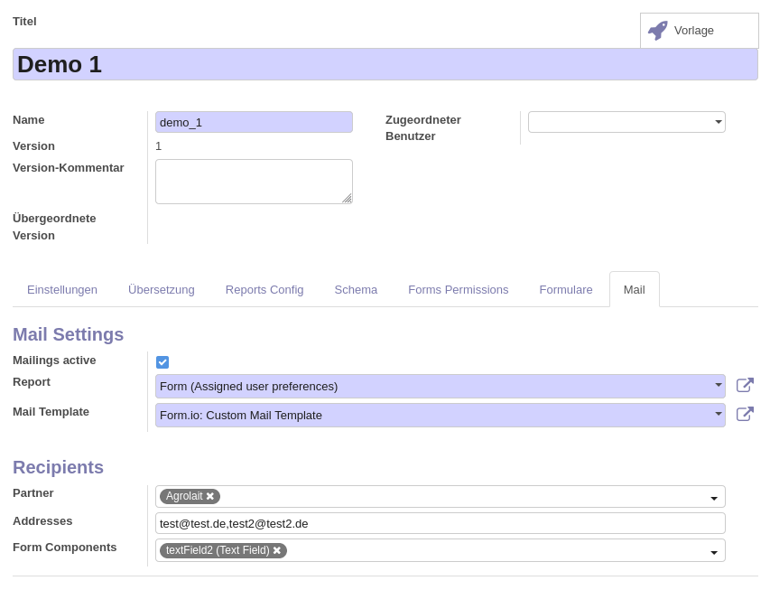

# Formio Mail Extension

This module aims to extend the Odoo form.io stack with features, such as:

* Send submitted forms as PDF to mail recipients
* Mail recipients can be specified in three ways:
    * Static mail address
    * Use partner mail address (contacts)
    * A user can specify the recipient in a form component
* Every form builder can have a own mail body and subject line
    
# Specify Recipients

There are the following three ways to specify a recipient:

## Using Partner Entry

By selecting one or multiple partner entries in:

``
formio -> builder -> mail -> Partner
``

The extension tries to access the partner.email field.
If the partner has a valid mail address the plugin will send the
form after submission, to specified partner's.

## Using Fixed Addresses

By specifying one or multiple **(comma-separated)** mail addresses in:

``
formio -> builder -> mail -> Addresses
``

The extension computes entered mail addresses and if 
they're valid the plugin will send the form after submission, 
to specified recipients.

It's a great feature for fixed, group or shared mail addresses.

## Using Form Components

By specifying one or multiple **(comma-separated)** form components in:

``
formio -> builder -> mail -> Form
``

The extension computes the value of the specified form components
after submission and if the value of a components holds a valid
mail address it tries to send a PDF report.

Form components need to be specified by it's key:

``
"label": "Text Field", "spellcheck": true, "tableView": true, "calculateServer": false, "key": "textField2", "type": "textfield", "input": true},
``

The key of the Text Field component above is: ``textField2``. So, if wanted to use this
component you had to enter the key ``textField2`` into the form field. 
It's also possible adding multiple components to the form field, 
but keep in mind, that these needs to be comma-separated.

Datagrid components are only supported with the depth of one. You have 
to specify this component as follow:

``
dataGrid->textField1
``

The first value is the key of the datagrid where as the second value 
the key of the inner component of the datagrid is.

## Supported Fields

The following form components are supported and working:

 - datagrid
 - email
 - select
 - selectboxes
 - textfield

# Authors and Contributors

- Nova Code
- Yannik Lieblinger
